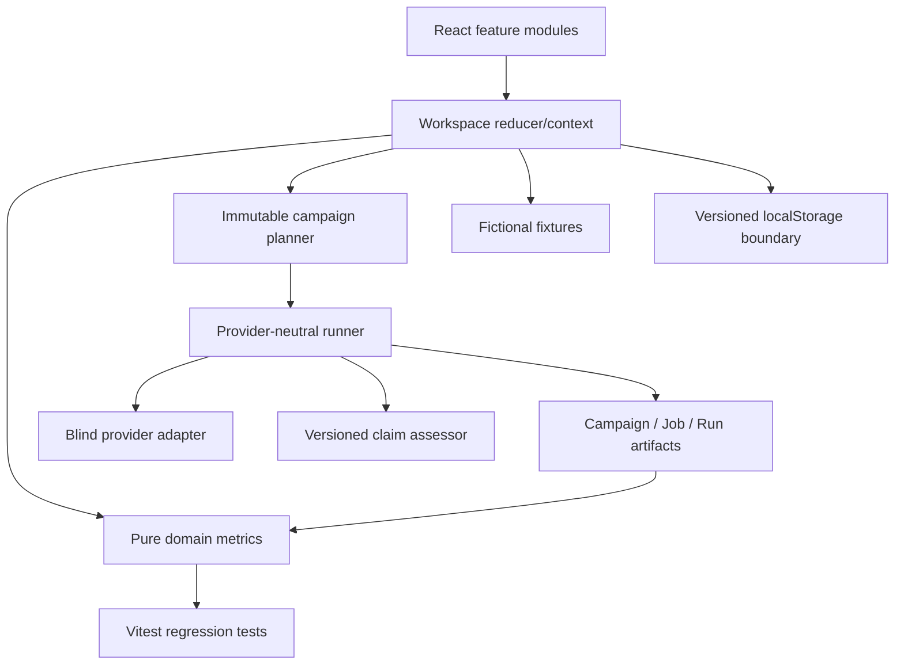
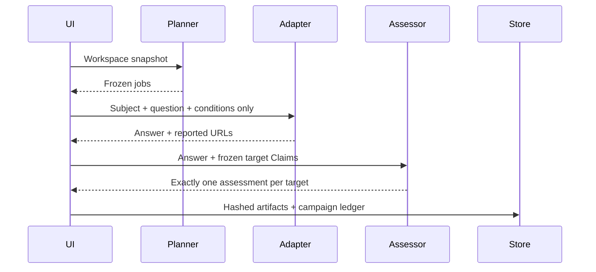
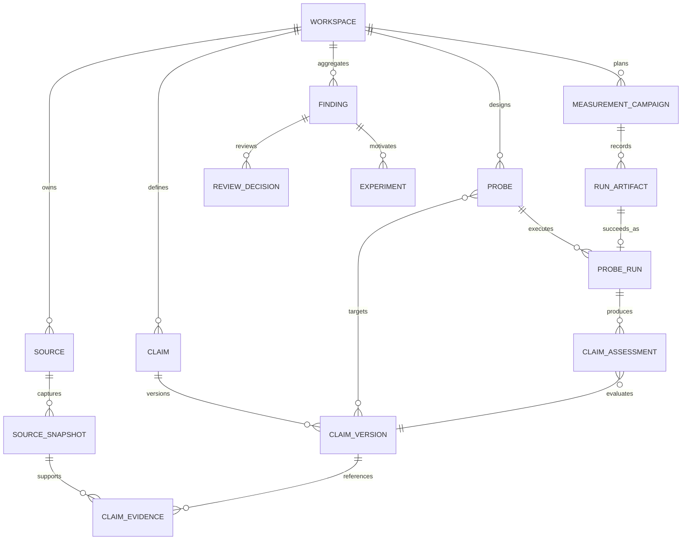

# Architecture

## Current milestone

現在は、APIキー不要でCore Loopを確認できるfrontend vertical sliceである。



### Boundaries

- `domain`: React、Browser API、Storageをimportしない
- `execution`: Campaign計画、Provider contract、評価、失敗・中止を含むArtifact生成
- `data`: 架空Fixtureと空Workspace factory
- `app`: routing、error boundary、state composition
- `features`: ユーザーのJob単位の画面
- `components`: 共通UIとworkflow dialog

localStorageからの読み込みはZodでversionと外形を検査し、不正データの場合はデモ初期状態へ戻す。state schema v1を読み込める移行層が旧RunのProvenanceを補完し、旧Campaign/Artifactへ`legacy-*` fingerprintを与えた後、v2として保存する。新規観測はすべて現在のversioned contractで保存する。

### Observation execution



重要な境界は、Adapterへ渡す`ProviderObservationRequest`にClaimや評価正解を含めないことである。Claimは回答取得後のAssessorだけが参照する。詳細は [Execution protocol](EXECUTION_PROTOCOL.md) と [ADR 0004](adr/0004-separate-acquisition-and-evaluation.md) を参照。

## Target production architecture

初期Production版もMicroservicesではなく、TypeScriptのModular Monolithとする。

```text
apps/
  web/       React application
  api/       Authorization and use cases
  worker/    Source fetch, provider run, assessment, aggregation
packages/
  domain/    Pure state transitions and metrics
  contracts/ API and job schemas
  provider-kit/
db/
  migrations/
docs/
  adr/
  threat-model/
```

### Storage

- PostgreSQL: normalized source of truth
- `SourceSnapshot` and `RunArtifact`: append-only
- `MeasurementCampaign`: planned job set、Evaluator version、完了状態、Campaign fingerprint
- Object storage: raw HTML/PDF/provider payloads when scale requires it
- Queue: idempotent `(campaign, probe, provider, repeat)` jobs

### Main model



## Why not Microservices yet

- Team sizeと実行量に対して運用複雑性が先行する
- Transaction、tenant scope、auditを一つのDB境界で保証しやすい
- ProviderとWorkerはmodule/interfaceで分離できる
- 実測後に高負荷なFetcherやRunnerだけを分離できる

## Why not a Graph DB yet

Source、Claim、Probe、Finding、Experimentの関係は多対多を含むが、履歴、制約、tenant isolationが重要であり、PostgreSQLで十分表現できる。グラフ探索が主要Jobになった時点で再評価する。

## Testing pyramid

- Unit: metrics, campaign plan, assessor boundaries, finding derivation
- Contract: provider adapter fixtures
- Execution: deterministic output, Claim leakage prevention, partial failure, cancellation ledger, fingerprint
- Integration: repository, migration, transaction, workspace isolation
- Worker: timeout, retry, idempotency, budget ceiling
- API: role matrix, validation, audit event
- E2E: Source → Claim → Probe → Finding → Action → remeasurement
- Accessibility: keyboard, focus, axe, 390px viewport
- Evaluation: versioned gold set and evaluator regression
