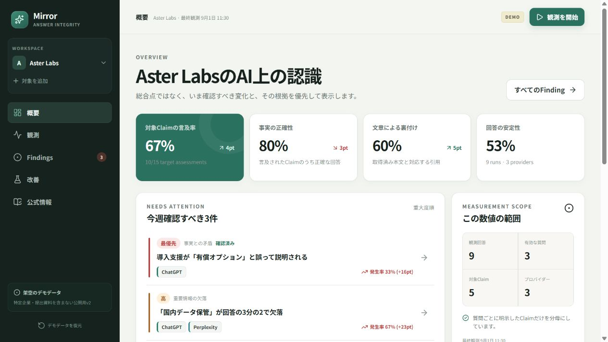
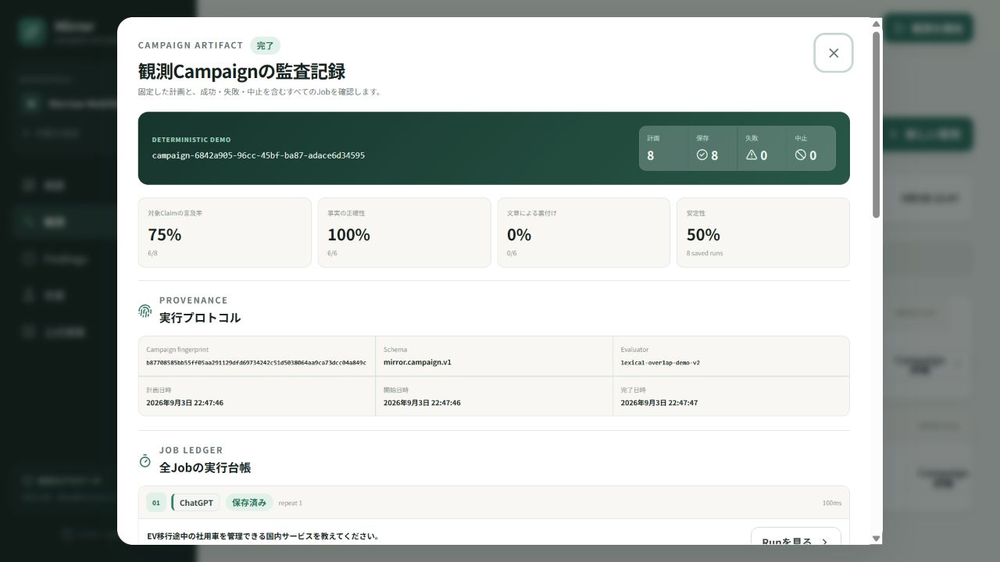
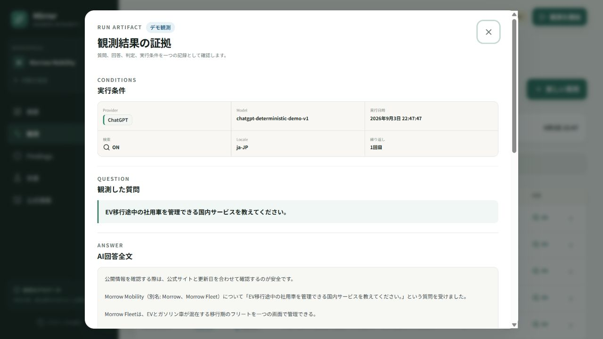
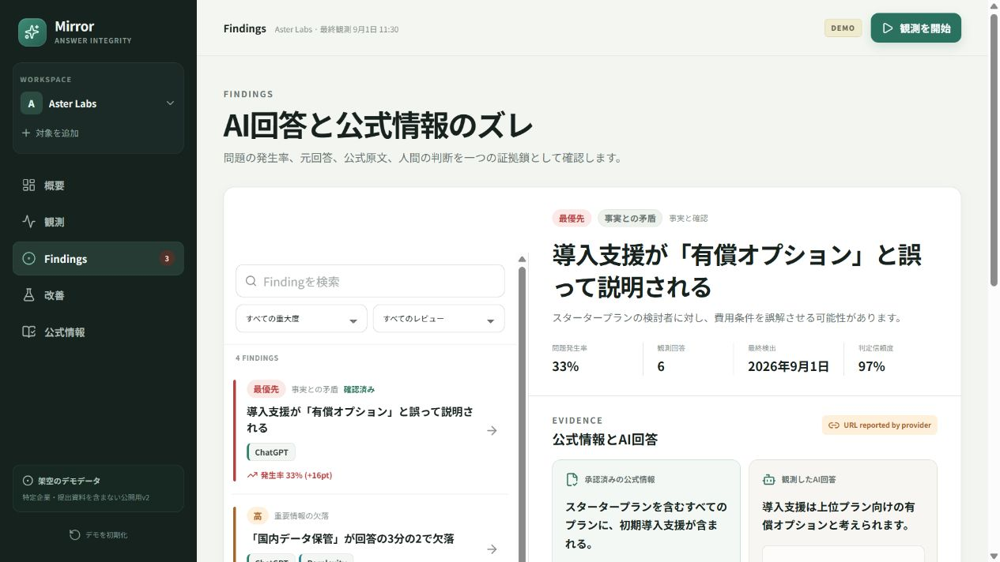
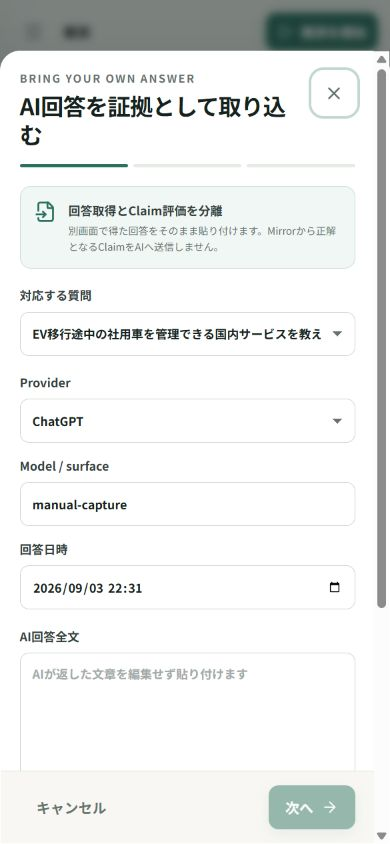
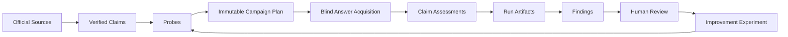

# Mirror: 開発記録（v0.3〜v0.8）

以下は2026-09-05までの開発時点の記録です。現行の紹介・起動手順は [README](../README.md) を参照してください。掲載画像はv0.3のもので、現行画面ではありません。

**AIが企業やサービスをどう説明しているか、回答と公式情報を見比べる「AI認識の比較ラボ」。**

Mirrorは、ひとつの質問への複数のAI回答を並べ、説明の違いを事実ごとに調べ、公式の根拠と人間の判断を残すアプリです。企業・サービスを調べる人を最初の利用者とし、「企業がどう見られているか」という視点は、AIによる説明の比較として残します。

> **非公開で開発中 / local-first。** 将来のポートフォリオ公開に向けた独立実装です。デモに登場する組織、URL、回答、人物はすべて架空です。公開・デプロイは行わず、元の提出用プロトタイプとは別ディレクトリで開発しています。

## v0.8: 資料が変わっても、過去の根拠へ戻れる

- 「公式情報」から原文と版履歴を開き、更新前後の文字差分を確認して、更新メモ付きで新しい版を手動保存
- 以前の原文を最大50版まで保持。上限を超えても古い証拠を自動削除しない
- 関連する確認項目を再確認に回し、対象プラン・条件・時点を人が照合して文章を修正。過去の回答・判定・レビューは書き換えない
- 比較ラボでは、観測時のhashに対応する過去原文を表示。旧本文がなければ現行本文で補わず、未収録と表示
- 後続の観測でFindingを再集計しても、同じ観測の保存根拠を保持。版履歴・原文未収録を扱う監査パックとバックアップはv3へ拡張し、従来のv1/v2も読み込み可能
- 「最新」「組織が正しいと認めた情報」を見直し、「保存済み」「人が確認済み」として確認範囲を明示

差分は文字の比較、影響範囲は参照関係の集計です。自動の意味理解・矛盾検出・Webページ再取得ではありません。[版管理の仕様と確認方法](SOURCE_HISTORY.md)。

## v0.7: 比較を主役にした画面、必要なときに読める説明

- 長い導入・回答全文カードを整理し、確認項目ごとの抜粋を揃えた比較シートへ
- ナビゲーションを白・水色基調に抑え、作業内容と選択位置に視線を集める構成
- 保存判定・デモ・資料版・条件差分はその場に残し、理由や全文は根拠パネルへ
- `/help` に操作・判定・資料の版・保存の説明を分離。比較からの往復で質問と回答選択を維持
- モバイルメニューの非表示時のTab移動を防ぎ、モーダル内の開閉要素・フォーカス復帰を改善

[UI設計方針と他プロジェクトでの使い方](UI_DESIGN.md) / [一次資料を中心にした再調査](UI_DESIGN_RESOURCE_RESEARCH.md)。Nielsenの原則を設計判断に使いましたが、実ユーザーの操作時間や満足度の向上はまだ測定していません。

## v0.6: 比較ラボを入口に、根拠へたどれる調査体験

- ホームで質問を選び、最大3件の保存回答を並べて比較。初期選択はAIごとの最新回答
- 同じAIの過去回答への切り替え、要確認項目の絞り込み、回答全文・実行条件の確認
- 事実ごとの保存判定から、根拠の原文と調査・判断画面へ移動
- 保存時の質問・確認項目を優先し、現行定義との差や旧形式の限界を明示
- 資料のhashが保存時と異なる場合、現在の本文を過去の根拠として表示しない
- 既存の改善実験を安定化。仮説・比較条件の固定、前後期間の記録、監査パック・バックアップへの収録を検証

**現在できるのは、保存済み回答と判定の比較です。新しい自動ファクトチェックや外部API取得はまだ行いません。** デモ判定には単語の重なりを使う簡易評価を含み、意味の正しさを保証するものではありません。公式情報も完全な真実とは限らず、対象プラン・時点・条件と出典を人が確認する必要があります。

今後は **外部APIでの回答取得 → 条件付きの説明を根拠と照合 → 未見の評価データで測定** の順で深めます。課金が発生するAPI利用は明示操作と予算制御を設ける方針です。事実照合そのものを独自発明とは主張せず、工夫は判定不能の扱い、条件の保存、評価実験で示します。[確定した開発方針](PRODUCT_DIRECTION.md) を参照してください。

## v0.5: 青と白のWorkspace、持ち出せる調査データ

白・水色・青を基調に配色を統一し、レイアウトを大きく変えずにコントラストを調整しました。警告・エラー・成功の意味色は残しています。

- 選択中のWorkspaceを、Campaign全Job・回答・レビュー・改善案まで丸ごとJSONへ保存
- 形式・参照・SHA-256を確認し、内容のプレビューと明示確認を経て復元
- 復元は別Workspaceの追加のみ。元データと過去の証拠ID・hashを変更しない
- 読み取れないlocalStorageをデモで上書きせず保護し、元の保存文字列を退避
- 保存容量不足でもメモリ内のデータを保持し、バックアップへの導線を表示
- 未計算の固定増減値を削除し、参考トレンドの限界を明記。同日観測のグラフ重複も修正

**使い方：** サイドバー（モバイルはメニュー）の「バックアップと復元」から作成し、「バックアップJSONを保存」まで行います。復元ファイルを選ぶだけではデータを追加しません。

ファイルは暗号化・自動伏せ字されません。自動バックアップ、クラウド同期、複数タブの競合解決は未実装です。[Backup and recovery](BACKUP_AND_RECOVERY.md) に形式、保護モード、制約をまとめています。

## v0.4からの調査フロー

Findingの詳細を **Incident Room** に再構成しました。保存された公式情報と元回答を比較し、別の回答へ切り替え、参照Runと判断理由を履歴に残し、改善仮説へつなげられます。

- 欠落・矛盾・帰属・根拠不足を混ぜず、問題別に検出率を再集計
- 判定不能と不整合Runを分母から分離。「古い情報」は自動で再判定しない
- 理由付きレビューと参照回答の記録・再表示。対象外からの再調査にも対応
- 確認済みかつ判定可能なFindingから、問題別の指標を持つAction下書きを作成
- 関連する回答全文、質問、公式原文、判定、レビュー、改善案をJSON監査パックへ出力
- 監査パックの構造・参照・SHA-256をブラウザ内で検証し、読み取り専用で閲覧
- 検索結果なし、無効な詳細URL、保存容量不足を明示し、復帰導線を用意

監査パックは電子署名でも、Workspace全体のバックアップでもありません。内容の真偽や作成者を証明しません。仕様とデモの進め方は [Incident Room / Evidence Pack](INCIDENT_ROOM.md) を参照してください。

以下の画像はv0.3時点の参考です。現行版は青・水色・白の配色に変わっています。



| Campaign ledger | Run artifact |
| --- | --- |
|  |  |

| Previous evidence inspector (v0.3) | Manual observation on mobile |
| --- | --- |
|  |  |

## What it solves

Mirrorが扱うのは「AIによって説明が違うとき、どの部分を何で確認すればよいか」という調査の負担です。企業向けの既存製品にも事実照合の機能があるため、それ自体を差別化とはせず、次の流れを個人が使える小さな体験にまとめます。

- 承認済みの公式ClaimとAI回答を事実単位で比較
- 公式原文、取得Snapshot、AI回答、判定、人間レビューを一つの証拠鎖として保存
- 言及、正確性、帰属、引用裏付け、安定性を別々に評価
- Findingから改善仮説を作り、同じ条件で前後を再測定
- AIの推論と人間の判断をUI・データの両方で分離



## Current vertical slice

- 架空の2組織を切り替えられるローカルデモ
- 質問ごとの最大3回答比較と、保存条件・根拠の確認
- 任意の企業・ブランド・製品・サービスを登録するオンボーディング
- 公式SourceとClaimの追加、SHA-256 Snapshot、Claim承認
- Audience、Intent、対象Claim、Provider、繰り返し回数を持つProbe設計
- `Probe × Provider × repetition` を実行前に固定するCampaign planner
- 公式Claimを回答取得側へ渡さないblind observation contract
- 再現可能なローカルDemo Adapterによる実Campaign、進捗表示、中止処理
- 任意のAI回答を持ち込める3-step manual observationと人手Claim評価
- 成功・失敗・中止を欠落なく残すCampaign / Job ledger
- Campaign、全Job、Runに対するSHA-256 fingerprintとEvaluator version
- Campaign → Job → Run → Claim判定へ遡れるEvidence Inspector
- 対象Claimだけを分母にする多次元メトリクス
- 公式原文とAI回答を比較するEvidence Inspector
- 理由・参照Run付きの人間レビューとAction Draft作成
- バージョン付きEvidence Packの書き出しと読み取り専用検証
- Workspace単位の完全バックアップ・コピー復元と、破損保存データの保護
- 改善前後のMeasurement Windowと状態遷移
- localStorage永続化と、ユーザーWorkspaceを消さないデモ復元
- Desktop / mobile responsive UI

外部AI APIは未接続です。現在の自動Campaignは、同じ入力から同じ回答を生成するローカルのdeterministic adapterで実行層全体を動かします。公開環境でAPIキーをブラウザへ置かないため、実Provider接続は今後のAPI / Worker層へ追加します。外部で取得した本物の回答は、APIキー不要のmanual observationから保存・評価できます。

## Run locally

Requirements: Node.js 22.12+ and pnpm 11+

```bash
pnpm install
pnpm dev
```

Quality gate:

```bash
pnpm check
```

`check` は typecheck、ESLint、Vitest、production buildを順に実行します。

v0.8の検証（2026-09-05）：`pnpm check` が通過（21ファイル・171テスト）。原文の版保存、再確認、過去の根拠保持、v3ファイル互換、未保存編集・保存失敗時の入力保持を追加検証しました。ローカルのin-app Chromiumでは1440px・390px・320px幅の資料画面を確認し、320pxでも横はみ出しがなく、保存ボタンと未保存編集の確認が使えること、編集へ戻ると入力欄にフォーカスが戻ることを確認しました。保存・履歴・復元の検証は隔離した自動テストで行い、実画面の確認では既存Workspaceを書き換えていません。詳細と未検証範囲は [原文の版管理と再確認](SOURCE_HISTORY.md) に記載しています。

v0.7の検証（2026-09-05）：`pnpm check` が通過（19ファイル・146テスト）。比較画面の回答選択、根拠・履歴表示、無効URL、空状態、実験記録とv1/v2ファイル互換に加え、ヘルプ往復での選択保持、モバイルメニュー、閉じた詳細を含むフォーカス制御を検証しました。ローカルのin-app Chromiumではデスクトップ・390px・320px幅で比較画面、根拠パネル、ヘルプを確認。モバイルの比較へのジャンプ、Tabでの全文開閉への移動、Escape後のフォーカス復帰を確認し、320pxで発見した最小幅による横はみ出しは修正して再確認しました。実APIの精度・費用、他ブラウザ、実ユーザーでの有用性は未検証です。

## Architecture

現時点は、プロダクト仮説を検証できるfrontend vertical sliceです。

```text
src/
├─ app/          Router, error boundary, workspace state
├─ components/   App shell, dialogs, shared UI
├─ data/         Fictional, provider-independent fixtures
├─ domain/       Framework-independent model and metrics
├─ execution/    Campaign planner, provider contracts, runner, demo evaluator
├─ features/     Compare, Overview, Observe, Findings, Actions, Sources
├─ styles/       Tokens and responsive design system
└─ test/         Shared test setup
```

次はこのdomainを中心に小さなサーバー側API境界を追加します。以前の [Architecture](ARCHITECTURE.md) にあるWorker・PostgreSQL等は拡張案であり、個人開発の初期要件にはしません。

回答取得と評価を分離した理由、Job状態、fingerprintの範囲、Provider Adapterの追加方法は [Execution protocol](EXECUTION_PROTOCOL.md) にまとめています。

## Important measurement invariant

質問が3つのClaimを対象とし、そのうち2つが言及された場合、他にWorkspace全体のClaimが何件あってもRecallは `2/3` です。

この回帰条件は [metrics.test.ts](../src/domain/metrics.test.ts) で固定しています。指標定義と限界は [Metric spec](METRIC_SPEC.md) に記載しています。

## Design decisions

- メインナビゲーションは `比較ラボ → 観測 → Findings → 改善 → 公式情報` の5つに限定
- 初期画面はひとつの質問と回答比較。従来のOverviewは「全体の指標」から参照
- 総合スコアを廃止し、原因を説明できる指標へ分解
- AI提案を自動実行せず、必ずHuman Reviewを通す
- 回答取得時には評価対象ClaimをProviderへ渡さない
- 中止や一部失敗を成功扱いせず、予定Job数との対応を台帳に残す
- Mobileは巨大な横スクロールNavではなくBottom Navigationを採用
- Graph DBやMicroservicesを先に導入せず、監査可能なデータ境界を優先
- 白・水色・青のUI。主要テキスト色のコントラストを自動テストで固定

判断の背景は [Product decisions](PRODUCT_DECISIONS.md)、就活デモの説明順は [Portfolio story](PORTFOLIO_STORY.md) にまとめています。

## Data and privacy

- デモは予約済み `.example` ドメインと自作Fixtureのみ
- 新規WorkspaceのデータはブラウザのlocalStorageに保存
- 外部APIへの送信は現在行わない
- manual observationへ貼り付けた回答も、このmilestoneではブラウザ内だけに保存
- 公開デモと実観測はUI上で区別
- バックアップファイルには入力した原文・回答全文も含まれるため、共有前の確認が必要

Production化前に必要な対策は [Threat model](THREAT_MODEL.md) に明記しています。

## Status

This is an actively developed portfolio product. The current milestone demonstrates an auditable observation loop with fictional data and imported answers. Source fetching, real provider workers, calibrated semantic evaluation, server-side persistence, and authentication are intentionally kept outside the browser-only milestone.

ライセンスは公開方法を決定してから設定します。現時点では無断での再配布・商用利用を許諾するライセンスは付与していません。
